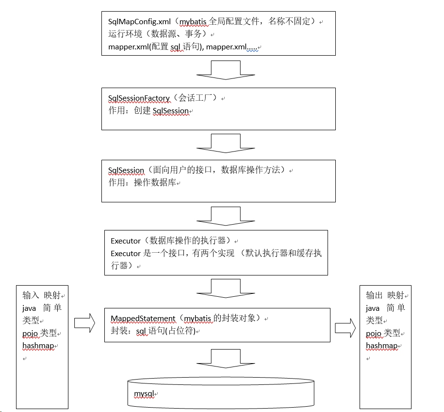

# Mybaits
## 使用JDBC的问题
1. 数据库连接频繁的创建和关闭，缺点浪费数据库的资源，影响操作效率。设想：使用数据库连接池
2. sql语句是硬编码，如果需求变更需要修改sql，就需要修改java代码，需要重新编译，系统不易维护。设想：将sql语句 统一配置在文件中，修改sql不需要修改java代码。
3. 通过preparedStatement向占位符设置参数，存在硬编码（ 参数位置，参数）问题。系统不易维护。设想：将sql中的占位符及对应的参数类型配置在配置文件中，能够自动输入映射。
4. 遍历查询结果集存在硬编码（列名）。设想：自动进行sql查询结果向java对象的映射（输出映射）。
## Mybatis介绍
- MyBatis 本是apache的一个开源项目iBatis, 2010年这个项目由apache software foundation 迁移到了google code，并且改名为MyBatis，实质上Mybatis对ibatis进行一些改进。 目前mybatis在github上托管。
- MyBatis是一个优秀的持久层框架，它对jdbc的操作数据库的过程进行封装，使开发者只需要关注 SQL 本身，而不需要花费精力去处理例如注册驱动、创建connection、创建statement、手动设置参数、结果集检索等jdbc繁杂的过程代码。
- Mybatis通过xml或注解的方式将要执行的各种statement（statement、preparedStatemnt、CallableStatement）配置起来，并通过java对象和statement中的sql进行映射生成最终执行的sql语句，最后由mybatis框架执行sql并将结果映射成java对象并返回。
## Mybatis架构



## Mybatis入门程序
- SqlMapConfig.xml(公用文件)
    - 通过SqlMapConfig.xml加载mybatis运行环境
```xml
<?xml version="1.0" encoding="UTF-8"?>
<!DOCTYPE configuration
PUBLIC "-//mybatis.org//DTD Config 3.0//EN"
"http://mybatis.org/dtd/mybatis-3-config.dtd">
<configuration>

	<!-- 和spring整合后 environments配置将废除-->
	<environments default="development">
		<environment id="development">
		<!-- 使用jdbc事务管理-->
			<transactionManager type="JDBC" />
		<!-- 数据库连接池-->
			<dataSource type="POOLED">
				<property name="driver" value="com.mysql.jdbc.Driver"/>
				<property name="url" value="jdbc:mysql://localhost:3306/mybatis"/>
				<property name="username" value="root"/>
				<property name="password" value="root"/>
			</dataSource>
		</environment>
	</environments>
	
	<!--加载mapper映射
	如果将和spring整合后，可以使用整合包中提供的mapper扫描器，此处的mappers不用配置了。
	 -->
	 <mappers>
	 	<mapper resource="sqlmap/User.xml"/>
	 </mappers>
	
</configuration>
```
- User.xml(重点)
    - 建议命名规则:表名+mapper.xml
    - 早期ibatis命名规则:表名.xml
```xml
<?xml version="1.0" encoding="UTF-8"?>
<!DOCTYPE mapper
PUBLIC "-//mybatis.org//DTD Mapper 3.0//EN"
"http://mybatis.org/dtd/mybatis-3-mapper.dtd">

<!-- 
	namespace命名空间，为了对sql语句进行隔离，方便管理 ，mapper开发dao方式，使用namespace有特殊作用
	mapper代理开发时将namespace指定为mapper接口的全限定名
 -->
<mapper namespace="test">

<!-- 在mapper.xml文件中配置很多的sql语句，执行每个sql语句时，封装为MappedStatement对象
mapper.xml以statement为单位管理sql语句
 -->
 
 	<!-- 根据id查询用户信息 -->
	<!-- 
		id：唯一标识 一个statement
		#{}：表示 一个占位符，如果#{}中传入简单类型的参数，#{}中的名称随意
		parameterType：输入参数的类型，通过#{}接收parameterType输入 的参数
		resultType：输出结果 类型，不管返回是多条还是单条，指定单条记录映射的pojo类型
	 -->
	<select id="findById" parameterType="int" resultType="vvr.mybatis.pojo.User">
		select * from user where id = #{id}
	</select>
	
	<!-- 
		根据用户名称查询用户信息，可能返回多条
		${}：表示sql的拼接，通过${value}接收参数，将参数的内容不加任何修饰拼接在sql中。
		这种方式不能防止sql注入
	 -->
	<select id="findByName" parameterType="String" resultType="vvr.mybatis.pojo.User">
		select * from user where username like '%${value}%'
	</select>
</mapper>
```
- 编码
```java
//会话工厂
	private SqlSessionFactory sqlSessionFactory;
	
	//创建工厂
	@Before
	public void init() throws IOException {
		//配置文件
		String resource = "SqlMapConfig.xml";
		
		//加载配置文件到输入流
		InputStream inputStream = Resources.getResourceAsStream(resource);
		
		//创建会话工厂
		sqlSessionFactory = new SqlSessionFactoryBuilder().build(inputStream);
	}

	/**
	 * 通过指定用户ID查询用户,得到单挑记录
	 */
	@Test
	public void findById() {
		
		//通过sqlSessionFactory创建sqlSession
		SqlSession sqlSession = sqlSessionFactory.openSession();
		User user = null;
		try {
			//通过sqlSession操作数据库
			//第一个参数：statement的位置，等于namespace+statement的id
			//第二个参数：传入的参数
			user = sqlSession.selectOne("test.findById", 10);
		}catch (Exception e) {
			e.printStackTrace();
		}finally {
			//关闭sqlSession
			sqlSession.close();
		}
		System.out.println(user);
	}
	
	/**
	 * 根据用户名模糊查询
	 */
	@Test
	public void findByName() {
		SqlSession sqlSession = sqlSessionFactory.openSession();
		List<User> list = null;
		try {
			list = sqlSession.selectList("test.findByName", "小明");
		}catch (Exception e) {
			e.printStackTrace();
		}finally {
			sqlSession.close();
		}
		for(User user : list) {
			System.out.println(user);
		}
	}
```

### [入门程序](https://github.com/wangwren/Mybatis/tree/master/mybatis_day01)
- 增删改查
- 主键返回(重要)

### 开发过程
1. 编写SqlMapConfing.xml
2. 编写mapper.xml
    - 定义了statement(官方也没有给出名称，暂且叫statement)
3. 编程通过配置文件创建SqlSessionFactory
4. 通过SqlSessionFactory获取SqlSession
5. 通过SqlSession操作数据库
    - 如果执行添加、更新、删除需要调用SqlSession.commit()
6. SqlSesion使用完成要关闭
### Mybatis解决jdbc编程问题
1. 数据库链接创建、释放频繁造成系统资源浪费从而影响系统性能，如果使用数据库链接池可解决此问题。
    - 解决：在SqlMapConfig.xml中配置数据链接池，使用连接池管理数据库链接。
2. Sql语句写在代码中造成代码不易维护，实际应用sql变化的可能较大，sql变动需要改变java代码。
    - 解决：将Sql语句配置在XXXXmapper.xml文件中与java代码分离。
3. 向sql语句传参数麻烦，因为sql语句的where条件不一定，可能多也可能少，占位符需要和参数一一对应。
    - 解决：Mybatis自动将java对象映射至sql语句，通过statement中的parameterType定义输入参数的类型。
4. 对结果集解析麻烦，sql变化导致解析代码变化，且解析前需要遍历，如果能将数据库记录封装成pojo对象解析比较方便。
    - 解决：Mybatis自动将sql执行结果映射至java对象，通过statement中的resultType定义输出结果的类型。
### mybatis与hibernate重要区别
- mybatis：入门简单，程序容易上手开发，节省开发成本 。mybatis需要程序员自己编写sql语句，是一个不完全 的ORM框架，对sql修改和优化非常容易实现 。
- mybatis适合开发需求变更频繁的系统，比如：互联网项目。
- hibernate：入门门槛高，如果用hibernate写出高性能的程序不容易实现。hibernate不用写sql语句，是一个 ORM框架。
- hibernate适合需求固定，对象数据模型稳定，中小型项目，比如：企业OA系统。
- 总之，企业在技术选型时根据项目实际情况，以降低成本和提高系统 可维护性为出发点进行技术选型。
## 小总结
### SqlMapConfig.xml
- 是mybatis全局配置文件，只有一个，名称不固定的，主要mapper.xml，mapper.xml中配置 sql语句
### Mapper.xml
- mapper.xml是以statement为单位进行配置。（把一个sql称为一个statement），satatement中配置 sql语句、parameterType输入参数类型（完成输入映射）、resultType输出结果类型（完成输出映射）。
- 还提供了parameterMap配置输入参数类型（过期了，不推荐使用了）
- 还提供resultMap配置输出结果类型（完成输出映射)
### \#{}
- 表示一个占位符，向占位符输入参数，mybatis自动进行java类型和jdbc类型的转换。程序员不需要考虑参数的类型，比如：传入字符串，mybatis最终拼接好的sql就是参数两边加单引号。
- \#{}接收pojo数据，可以**使用OGNL解析出pojo的属性值**
### ${}
- 表示sql的拼接，通过${}接收参数，将参数的内容不加任何修饰拼接在sql中。
- ${}也可以接收pojo数据，可以使用OGNL解析出pojo的属性值
- 缺点：不能防止sql注入。
### selectOne
- 用于查询单条记录，不能用于查询多条记录，否则异常：
```java
org.apache.ibatis.exceptions.TooManyResultsException: Expected one result (or null) to be returned by selectOne(), but found: 4
```
### selectList
- 用于查询多条记录，可以用于查询单条记录的。
## mybatis开发的方法
### SqlSession作用范围
- SqlSessionFactoryBuilder
    - SqlSessionFactoryBuilder是以工具类方式来使用，需要创建sqlSessionFactory就new一个SqlSessionFactoryBuilder。
- SqlSessionFactory
    - 正常开发时，以单例方式管理sqlSessionFactory，整个系统运行过程中sqlSessionFactory只有一个实例，将来和spring整合后由spring以单例方式管理sqlSessionFactory。
- SqlSession
    - sqlSession是一个面向用户（程序员）的接口，程序员调用sqlSession的接口方法进行操作数据库。
    - 由于sqlSession是**线程不安全**，所以sqlSession最佳应用范围在方法体内，在方法体内定义局部变量使用sqlSession。
### 原始dao开发方式
程序员需要写dao接口和dao的实现类
### mapper代理的方式
程序员只需要写dao接口，**dao接口实现对象由mybatis自动生成代理对象**。本身dao在三层架构中就是一个通用的接口。
- 原始dao开发方式问题
    - dao的实现类中存在重复代码，整个mybatis操作的过程代码模板重复（先创建sqlsession、调用sqlsession的方法、关闭sqlsession）
    - dao的实现类中存在硬编码，调用sqlsession方法时将statement的id硬编码。
#### mapper开发规范
要想让mybatis自动创建dao接口实现类的代理对象，必须遵循一些规则:  
- mapper.xml中namespace指定为mapper接口的全限定名(全类名)
```xml
<!--UserMapper.xml-->
<?xml version="1.0" encoding="UTF-8"?>
<!DOCTYPE mapper
PUBLIC "-//mybatis.org//DTD Mapper 3.0//EN"
"http://mybatis.org/dtd/mybatis-3-mapper.dtd">

<!-- 
	namespace命名空间，为了对sql语句进行隔离，方便管理 ，mapper开发dao方式，使用namespace有特殊作用
	mapper代理开发时将namespace指定为mapper接口的全限定名(即接口的全类名)
 -->
<mapper namespace="vvr.mybatis.mapper.UserMapper">
```
此步骤目的:通过mapper.xml(UserMapper.xml)和mapper.java(UserMapper.java)进行关联  
- mapper.xml中statement的id就是mapper.java中方法名
- mapper.xml中statement的parameterType和mapper.java中方法输入参数类型一致
- mapper.xml中statement的resultType和mapper.java返回值类型一致
#### mapper.xml
- mapper.xml映射文件的命名方式建议:表名+Mapper.xml  
- namespace指定为mapper接口的全限定名  
```xml
<!--UserMapper.xml-->
<?xml version="1.0" encoding="UTF-8"?>
<!DOCTYPE mapper
PUBLIC "-//mybatis.org//DTD Mapper 3.0//EN"
"http://mybatis.org/dtd/mybatis-3-mapper.dtd">
<mapper namespace="vvr.mybatis.mapper.UserMapper">
 	<!-- 根据id查询用户信息 -->
	<select id="findById" parameterType="int" resultType="vvr.mybatis.pojo.User">
		select * from user where id = #{id}
	</select>
</mapper>
```
#### mapper接口
- mybatis提出了mapper接口，相当于dao接口
- mybatis接口的命名方式建议:表名+Mapper
```java
//UserMapper.java
public interface UserMapper {

	/**
	 * 查询指定用户
	 * @param id
	 * @return
	 * @throws Exception
	 */
	public User findById(int id) throws Exception;
```
#### 将mapper.xml在SqlMapConfig.xml中加载
```xml
<mappers>
 	<mapper resource="sqlmap/User.xml"/>
 	<mapper resource="mapper/UserMapper.xml"/>
</mappers>
```
#### mapper接口返回单个对象和集合对象
不管查询记录是单条还是多条，在 statement中resultType定义一致，都是单条记录映射的pojo类型。  
mapper接口方法返回值，如果是**返回的单个对象**，返回值类型是**pojo类型**，生成的代理对象**内部通过selectOne获取记录**，如果返回值类型**是集合对象**，生成的代理对象**内部通过selectList获取记录**。
#### 返回值问题
如果方法调用的statement，返回是多条记录，而mapper.java方法的返回值为pojo类型，此时代理对象通过selectOne调用，由于返回多条记录，所以报错：
```java
org.apache.ibatis.exceptions.TooManyResultsException: Expected one result (or null) to be returned by selectOne(), but found: 4
```
#### 输入参数问题
- 使用mapper代理的方式开发，mapper接口方法输入 参数只有一个，可扩展性是否很差？？
    - 可扩展性没有问题，因为dao层就是通用的，可以通过扩展pojo（定义pojo包装类型）将不同的参数（可以是pojo也可以简单类型）传入进去。
### SqlMapConfig.xml配置
- SqlMapConfig.xml中配置的内容和顺序如下
    1. properties(属性)
    2. settings(全局配置参数)
    3. typeAliases(类型别名)
    4. typeHandlers(类型处理器)
    5. objectFactory(对象工厂)
    6. plugins(插件)
    7. environments(环境集合属性对象)
        - environment(环境子属性对象)
            - transactionManager(事务管理)
            - dataSource(数据源)
    8. mappers(映射器)
#### properties属性定义
可以把一些通用的属性值配置在属性文件中，加载到mybatis运行环境中内。比如:创建db.properties配置数据库连接参数。
```xml
<!-- 属性定义 -->
<properties resource="db.properties"></properties>
<!-- 和spring整合后 environments配置将废除-->
<environments default="development">
	<environment id="development">
	<!-- 使用jdbc事务管理-->
		<transactionManager type="JDBC" />
	<!-- 数据库连接池-->
		<dataSource type="POOLED">
    		<property name="driver" value="${jdbc.driver}"/>
			<property name="url" value="${jdbc.url}"/>
			<property name="username" value="${jdbc.username}"/>
    		<property name="password" value="${jdbc.password}"/>
		</dataSource>
	</environment>
</environments>
```
注意:mybatis将按照下面的顺序来加载属性:
- 在properties元素体内定义的属性首先被读取
- 然后会读取properties元素中resource或url加载的属性，它会覆盖已读取的同名属性。
- 最后读取parameterType传递的属性，它会覆盖已读取的同名属性。  
建议使用properties，不要在properties中定义属性，只引用定义的properties文件中属性，定义的key要有一些特殊的规则。
#### settings全局参数配置
mybatis运行时可以调整一些全局参数(相当于软件的运行参数)，参考:[mybatis-settings.xlsx](https://github.com/wangwren/Mybatis/blob/master/mybatis-settings.xlsx),根据使用需求进行参数配置。  
注意:小心配置，配置参数会影响mybatis的执行。
#### typeAliases(常用)
可以将parameterType、resultType中指定的类型通过别名引用。  
mybatis提供了很多别名:

别名|映射的类型|
|--------------|--------------|
|_byte|byte|
|_long|long|
|_short|short|
|_int|int|
|_integer|int|
|_double|double|
|_float|float|
|_boolean|boolean|
|string|String|
|byte|Byte|
|long|Long|
|short|Short|
|int|Integer|
|integer|Integer|
|double|Double|
|float|Float|
|boolean|Boolean|
|date|Date|
|decimal|BigDecimal|
|bigdecimal|BigDecimal|
#### 自定义别名和使用别名
```xml
<!--SqlMapConfig.xml-->
<!-- 别名定义 -->
	<typeAliases>
		<!-- 
			指定单个别名 
			type:别名类型映射
			alias：别名
			在UserMapper.xml中对于参数类型的指定就可以使用该别名	
		-->
		<!-- <typeAlias type="vvr.mybatis.pojo.User" alias="user"/> -->
		
		
		<!-- 批量指定别名，
			指定包路径，自动扫描包下边的pojo，定义别名，别名默认为类名（首字母大写或小写）
		 -->
		 <package name="vvr.mybatis.pojo"/>
		
	</typeAliases>
```
使用别名:
```xml
<!--UserMapper.xml-->
<select id="findById" parameterType="int" resultType="user">
	select * from user where id = #{id}
</select>
```
#### typeHandlers
类型处理器将java类型和jdbc类型进行映射。  
mybatis默认提供很多类型处理器，一般情况下够用了。
#### mappers
```xml
<!--SqlMapConfig.xml-->
<mappers>
	 	<!-- 通过resource引用mapper映射文件 -->
	 	<mapper resource="sqlmap/User.xml"/>
	 	<!-- <mapper resource="mapper/UserMapper.xml"/> -->
	 	
	 	
	 	<!-- 通过class引用mapper接口
	 		 class:配置mapper接口的全路径类名
	 		 要求：需要mapper.xml和mapper.java同名并且在同一个目录中
	 	 -->
	 	<!-- <mapper class="vvr.mybatis.mapper.UserMapper"/> -->
	 	
	 	
	 	<!-- 批量mapper配置 
	 		通过package自动扫描包下边的mapper接口
	 		 要求：需要mapper.xml和mapper.java同名并且在同一个目录中
	 	-->
	 	<package name="vvr.mybatis.mapper"/>
</mappers>
```
### 输入和输出映射
通过parameterType完成输入映射，通过resultType和resultMap完成输出映射。  
#### parameteType传递pojo包装对象
可以定义pojo包装类型扩展mapper接口输入参数的内容。  
需求:自定义查询条件查询用户信息，需要向statement输入查询条件，查询条件可以有user信息、商品信息....  
- 包装类型
```java
public class UserQueryVo {
	//用户信息
	private User user;
	//自定义user的扩展对象
	private UserCustomer userCustomer;
	
	//提供getter和setter方法
}
```
- mapper.xml
```xml
<!-- 
	自定义查询条件来查询用户信息，
	通过pojo的扩展对象来实现
-->
<select id="findUserList" parameterType="userQueryVo" resultType="user">
 	select * from user where username like '%${userCustomer.username}%'
</select>
```
- mapper.java
```java
public List<User> findUserList(UserQueryVo userQueryVo) throws Exception;
```
- 测试
```java
public void findUserList() throws Exception {
		SqlSession sqlSession = sqlSessionFactory.openSession();
		UserMapper userMapper = sqlSession.getMapper(UserMapper.class);
		UserQueryVo userQueryVo = new UserQueryVo();
		UserCustomer userCustomer = new UserCustomer();
		userCustomer.setUsername("小明");
		userQueryVo.setUserCustomer(userCustomer);
		List<User> list = userMapper.findUserList(userQueryVo);
		for(User user : list) {
			System.out.println(user);
		}
		sqlSession.close();
	}
```
**注意:如果和spring整合后，不是通过调用getter方法来获取属性值，通过反射强读取pojo的属性值**
#### resultType
指定输出结果的类型(pojo、简单类型、hashMap)，将sql查询结果映射为java对象。  
- 返回简单数据类型，代码中有，需要注意:如果查询记录结果集为**一条记录且一列再使用返回简单数据类型**。
#### resultMap(入门)
##### resultType和resultMap区别
- resultType:指定输出结果的类型(pojo、简单类型、hashMap)，将SQL查询结果映射为java对象。
    - 使用resultType注意：**sql查询的列名(如果另起别名)要和resultType指定pojo的属性名相同，指定相同属性方可映射成功，如果sql查询的列名和resultType指定pojo的属性名全部不相同，list中无法创建pojo对象的**(list即返回的结果集无数据)。
- resultMap:将sql查询结果映射为java对象
    - 如果sql查询列名和最终要映射的pojo的属性名不一致，使用resultMap将列名和pojo的属性名做一个对应关系 （列名和属性名映射配置）


