# Mybaits
## 使用JDBC的问题
1. 数据库连接频繁的创建和关闭，缺点浪费数据库的资源，影响操作效率。设想：使用数据库连接池
2. sql语句是硬编码，如果需求变更需要修改sql，就需要修改java代码，需要重新编译，系统不易维护。设想：将sql语句 统一配置在文件中，修改sql不需要修改java代码。
3. 通过preparedStatement向占位符设置参数，存在硬编码（ 参数位置，参数）问题。系统不易维护。设想：将sql中的占位符及对应的参数类型配置在配置文件中，能够自动输入映射。
4. 遍历查询结果集存在硬编码（列名）。设想：自动进行sql查询结果向java对象的映射（输出映射）。
## Mybatis介绍
- MyBatis 本是apache的一个开源项目iBatis, 2010年这个项目由apache software foundation 迁移到了google code，并且改名为MyBatis，实质上Mybatis对ibatis进行一些改进。 目前mybatis在github上托管。
- MyBatis是一个优秀的持久层框架，它对jdbc的操作数据库的过程进行封装，使开发者只需要关注 SQL 本身，而不需要花费精力去处理例如注册驱动、创建connection、创建statement、手动设置参数、结果集检索等jdbc繁杂的过程代码。
- Mybatis通过xml或注解的方式将要执行的各种statement（statement、preparedStatemnt、CallableStatement）配置起来，并通过java对象和statement中的sql进行映射生成最终执行的sql语句，最后由mybatis框架执行sql并将结果映射成java对象并返回。
## Mybatis架构


## Mybatis入门程序
- SqlMapConfig.xml(公用文件)
    - 通过SqlMapConfig.xml加载mybatis运行环境
```xml
<?xml version="1.0" encoding="UTF-8"?>
<!DOCTYPE configuration
PUBLIC "-//mybatis.org//DTD Config 3.0//EN"
"http://mybatis.org/dtd/mybatis-3-config.dtd">
<configuration>

	<!-- 和spring整合后 environments配置将废除-->
	<environments default="development">
		<environment id="development">
		<!-- 使用jdbc事务管理-->
			<transactionManager type="JDBC" />
		<!-- 数据库连接池-->
			<dataSource type="POOLED">
				<property name="driver" value="com.mysql.jdbc.Driver"/>
				<property name="url" value="jdbc:mysql://localhost:3306/mybatis"/>
				<property name="username" value="root"/>
				<property name="password" value="root"/>
			</dataSource>
		</environment>
	</environments>
	
	<!--加载mapper映射
	如果将和spring整合后，可以使用整合包中提供的mapper扫描器，此处的mappers不用配置了。
	 -->
	 <mappers>
	 	<mapper resource="sqlmap/User.xml"/>
	 </mappers>
	
</configuration>
```
- User.xml(重点)
    - 建议命名规则:表名+mapper.xml
    - 早期ibatis命名规则:表名.xml
```xml
<?xml version="1.0" encoding="UTF-8"?>
<!DOCTYPE mapper
PUBLIC "-//mybatis.org//DTD Mapper 3.0//EN"
"http://mybatis.org/dtd/mybatis-3-mapper.dtd">

<!-- 
	namespace命名空间，为了对sql语句进行隔离，方便管理 ，mapper开发dao方式，使用namespace有特殊作用
	mapper代理开发时将namespace指定为mapper接口的全限定名
 -->
<mapper namespace="test">

<!-- 在mapper.xml文件中配置很多的sql语句，执行每个sql语句时，封装为MappedStatement对象
mapper.xml以statement为单位管理sql语句
 -->
 
 	<!-- 根据id查询用户信息 -->
	<!-- 
		id：唯一标识 一个statement
		#{}：表示 一个占位符，如果#{}中传入简单类型的参数，#{}中的名称随意
		parameterType：输入参数的类型，通过#{}接收parameterType输入 的参数
		resultType：输出结果 类型，不管返回是多条还是单条，指定单条记录映射的pojo类型
	 -->
	<select id="findById" parameterType="int" resultType="vvr.mybatis.pojo.User">
		select * from user where id = #{id}
	</select>
	
	<!-- 
		根据用户名称查询用户信息，可能返回多条
		${}：表示sql的拼接，通过${value}接收参数，将参数的内容不加任何修饰拼接在sql中。
		这种方式不能防止sql注入
	 -->
	<select id="findByName" parameterType="String" resultType="vvr.mybatis.pojo.User">
		select * from user where username like '%${value}%'
	</select>
</mapper>
```
- 编码
```java
//会话工厂
	private SqlSessionFactory sqlSessionFactory;
	
	//创建工厂
	@Before
	public void init() throws IOException {
		//配置文件
		String resource = "SqlMapConfig.xml";
		
		//加载配置文件到输入流
		InputStream inputStream = Resources.getResourceAsStream(resource);
		
		//创建会话工厂
		sqlSessionFactory = new SqlSessionFactoryBuilder().build(inputStream);
	}

	/**
	 * 通过指定用户ID查询用户,得到单挑记录
	 */
	@Test
	public void findById() {
		
		//通过sqlSessionFactory创建sqlSession
		SqlSession sqlSession = sqlSessionFactory.openSession();
		User user = null;
		try {
			//通过sqlSession操作数据库
			//第一个参数：statement的位置，等于namespace+statement的id
			//第二个参数：传入的参数
			user = sqlSession.selectOne("test.findById", 10);
		}catch (Exception e) {
			e.printStackTrace();
		}finally {
			//关闭sqlSession
			sqlSession.close();
		}
		System.out.println(user);
	}
	
	/**
	 * 根据用户名模糊查询
	 */
	@Test
	public void findByName() {
		SqlSession sqlSession = sqlSessionFactory.openSession();
		List<User> list = null;
		try {
			list = sqlSession.selectList("test.findByName", "小明");
		}catch (Exception e) {
			e.printStackTrace();
		}finally {
			sqlSession.close();
		}
		for(User user : list) {
			System.out.println(user);
		}
	}
```

### [入门程序](https://github.com/wangwren/Mybatis/tree/master/mybatis_day01)
- 增删改查
- 主键返回(重要)

### 开发过程
1. 编写SqlMapConfing.xml
2. 编写mapper.xml
    - 定义了statement(官方也没有给出名称，暂且叫statement)
3. 编程通过配置文件创建SqlSessionFactory
4. 通过SqlSessionFactory获取SqlSession
5. 通过SqlSession操作数据库
    - 如果执行添加、更新、删除需要调用SqlSession.commit()
6. SqlSesion使用完成要关闭
### Mybatis解决jdbc编程问题
1. 数据库链接创建、释放频繁造成系统资源浪费从而影响系统性能，如果使用数据库链接池可解决此问题。
    - 解决：在SqlMapConfig.xml中配置数据链接池，使用连接池管理数据库链接。
2. Sql语句写在代码中造成代码不易维护，实际应用sql变化的可能较大，sql变动需要改变java代码。
    - 解决：将Sql语句配置在XXXXmapper.xml文件中与java代码分离。
3. 向sql语句传参数麻烦，因为sql语句的where条件不一定，可能多也可能少，占位符需要和参数一一对应。
    - 解决：Mybatis自动将java对象映射至sql语句，通过statement中的parameterType定义输入参数的类型。
4. 对结果集解析麻烦，sql变化导致解析代码变化，且解析前需要遍历，如果能将数据库记录封装成pojo对象解析比较方便。
    - 解决：Mybatis自动将sql执行结果映射至java对象，通过statement中的resultType定义输出结果的类型。
### mybatis与hibernate重要区别
- mybatis：入门简单，程序容易上手开发，节省开发成本 。mybatis需要程序员自己编写sql语句，是一个不完全 的ORM框架，对sql修改和优化非常容易实现 。
- mybatis适合开发需求变更频繁的系统，比如：互联网项目。
- hibernate：入门门槛高，如果用hibernate写出高性能的程序不容易实现。hibernate不用写sql语句，是一个 ORM框架。
- hibernate适合需求固定，对象数据模型稳定，中小型项目，比如：企业OA系统。
- 总之，企业在技术选型时根据项目实际情况，以降低成本和提高系统 可维护性为出发点进行技术选型。
## 小总结
### SqlMapConfig.xml
- 是mybatis全局配置文件，只有一个，名称不固定的，主要mapper.xml，mapper.xml中配置 sql语句
### Mapper.xml
- mapper.xml是以statement为单位进行配置。（把一个sql称为一个statement），satatement中配置 sql语句、parameterType输入参数类型（完成输入映射）、resultType输出结果类型（完成输出映射）。
- 还提供了parameterMap配置输入参数类型（过期了，不推荐使用了）
- 还提供resultMap配置输出结果类型（完成输出映射)
### \#{}
- 表示一个占位符，向占位符输入参数，mybatis自动进行java类型和jdbc类型的转换。程序员不需要考虑参数的类型，比如：传入字符串，mybatis最终拼接好的sql就是参数两边加单引号。
- \#{}接收pojo数据，可以**使用OGNL解析出pojo的属性值**
### ${}
- 表示sql的拼接，通过${}接收参数，将参数的内容不加任何修饰拼接在sql中。
- ${}也可以接收pojo数据，可以使用OGNL解析出pojo的属性值
- 缺点：不能防止sql注入。
### selectOne
- 用于查询单条记录，不能用于查询多条记录，否则异常：
```java
org.apache.ibatis.exceptions.TooManyResultsException: Expected one result (or null) to be returned by selectOne(), but found: 4
```
### selectList
- 用于查询多条记录，可以用于查询单条记录的。
## mybatis开发的方法
### SqlSession作用范围
- SqlSessionFactoryBuilder
    - SqlSessionFactoryBuilder是以工具类方式来使用，需要创建sqlSessionFactory就new一个SqlSessionFactoryBuilder。
- SqlSessionFactory
    - 正常开发时，以单例方式管理sqlSessionFactory，整个系统运行过程中sqlSessionFactory只有一个实例，将来和spring整合后由spring以单例方式管理sqlSessionFactory。
- SqlSession
    - sqlSession是一个面向用户（程序员）的接口，程序员调用sqlSession的接口方法进行操作数据库。
    - 由于sqlSession是**线程不安全**，所以sqlSession最佳应用范围在方法体内，在方法体内定义局部变量使用sqlSession。
### 原始dao开发方式
程序员需要写dao接口和dao的实现类
### mapper代理的方式
程序员只需要写dao接口，**dao接口实现对象由mybatis自动生成代理对象**。本身dao在三层架构中就是一个通用的接口。
- 原始dao开发方式问题
    - dao的实现类中存在重复代码，整个mybatis操作的过程代码模板重复（先创建sqlsession、调用sqlsession的方法、关闭sqlsession）
    - dao的实现类中存在硬编码，调用sqlsession方法时将statement的id硬编码。
#### mapper开发规范
要想让mybatis自动创建dao接口实现类的代理对象，必须遵循一些规则:  
- mapper.xml中namespace指定为mapper接口的全限定名(全类名)
```xml
<!--UserMapper.xml-->
<?xml version="1.0" encoding="UTF-8"?>
<!DOCTYPE mapper
PUBLIC "-//mybatis.org//DTD Mapper 3.0//EN"
"http://mybatis.org/dtd/mybatis-3-mapper.dtd">

<!-- 
	namespace命名空间，为了对sql语句进行隔离，方便管理 ，mapper开发dao方式，使用namespace有特殊作用
	mapper代理开发时将namespace指定为mapper接口的全限定名(即接口的全类名)
 -->
<mapper namespace="vvr.mybatis.mapper.UserMapper">
```
此步骤目的:通过mapper.xml(UserMapper.xml)和mapper.java(UserMapper.java)进行关联  
- mapper.xml中statement的id就是mapper.java中方法名
- mapper.xml中statement的parameterType和mapper.java中方法输入参数类型一致
- mapper.xml中statement的resultType和mapper.java返回值类型一致
#### mapper.xml
- mapper.xml映射文件的命名方式建议:表名+Mapper.xml  
- namespace指定为mapper接口的全限定名  
```xml
<!--UserMapper.xml-->
<?xml version="1.0" encoding="UTF-8"?>
<!DOCTYPE mapper
PUBLIC "-//mybatis.org//DTD Mapper 3.0//EN"
"http://mybatis.org/dtd/mybatis-3-mapper.dtd">
<mapper namespace="vvr.mybatis.mapper.UserMapper">
 	<!-- 根据id查询用户信息 -->
	<select id="findById" parameterType="int" resultType="vvr.mybatis.pojo.User">
		select * from user where id = #{id}
	</select>
</mapper>
```
#### mapper接口
- mybatis提出了mapper接口，相当于dao接口
- mybatis接口的命名方式建议:表名+Mapper
```java
//UserMapper.java
public interface UserMapper {

	/**
	 * 查询指定用户
	 * @param id
	 * @return
	 * @throws Exception
	 */
	public User findById(int id) throws Exception;
```
#### 将mapper.xml在SqlMapConfig.xml中加载
```xml
<mappers>
 	<mapper resource="sqlmap/User.xml"/>
 	<mapper resource="mapper/UserMapper.xml"/>
</mappers>
```
#### mapper接口返回单个对象和集合对象
不管查询记录是单条还是多条，在 statement中resultType定义一致，都是单条记录映射的pojo类型。  
mapper接口方法返回值，如果是**返回的单个对象**，返回值类型是**pojo类型**，生成的代理对象**内部通过selectOne获取记录**，如果返回值类型**是集合对象**，生成的代理对象**内部通过selectList获取记录**。
#### 返回值问题
如果方法调用的statement，返回是多条记录，而mapper.java方法的返回值为pojo类型，此时代理对象通过selectOne调用，由于返回多条记录，所以报错：
```java
org.apache.ibatis.exceptions.TooManyResultsException: Expected one result (or null) to be returned by selectOne(), but found: 4
```
#### 输入参数问题
- 使用mapper代理的方式开发，mapper接口方法输入 参数只有一个，可扩展性是否很差？？
    - 可扩展性没有问题，因为dao层就是通用的，可以通过扩展pojo（定义pojo包装类型）将不同的参数（可以是pojo也可以简单类型）传入进去。
### SqlMapConfig.xml配置
- SqlMapConfig.xml中配置的内容和顺序如下
    1. properties(属性)
    2. settings(全局配置参数)
    3. typeAliases(类型别名)
    4. typeHandlers(类型处理器)
    5. objectFactory(对象工厂)
    6. plugins(插件)
    7. environments(环境集合属性对象)
        - environment(环境子属性对象)
            - transactionManager(事务管理)
            - dataSource(数据源)
    8. mappers(映射器)
#### properties属性定义
可以把一些通用的属性值配置在属性文件中，加载到mybatis运行环境中内。比如:创建db.properties配置数据库连接参数。
```xml
<!-- 属性定义 -->
<properties resource="db.properties"></properties>
<!-- 和spring整合后 environments配置将废除-->
<environments default="development">
	<environment id="development">
	<!-- 使用jdbc事务管理-->
		<transactionManager type="JDBC" />
	<!-- 数据库连接池-->
		<dataSource type="POOLED">
    		<property name="driver" value="${jdbc.driver}"/>
			<property name="url" value="${jdbc.url}"/>
			<property name="username" value="${jdbc.username}"/>
    		<property name="password" value="${jdbc.password}"/>
		</dataSource>
	</environment>
</environments>
```
注意:mybatis将按照下面的顺序来加载属性:
- 在properties元素体内定义的属性首先被读取
- 然后会读取properties元素中resource或url加载的属性，它会覆盖已读取的同名属性。
- 最后读取parameterType传递的属性，它会覆盖已读取的同名属性。  
建议使用properties，不要在properties中定义属性，只引用定义的properties文件中属性，定义的key要有一些特殊的规则。
#### settings全局参数配置
mybatis运行时可以调整一些全局参数(相当于软件的运行参数)，参考:[mybatis-settings.xlsx](https://github.com/wangwren/Mybatis/blob/master/mybatis-settings.xlsx),根据使用需求进行参数配置。  
注意:小心配置，配置参数会影响mybatis的执行。
#### typeAliases(常用)
可以将parameterType、resultType中指定的类型通过别名引用。  
mybatis提供了很多别名:

别名|映射的类型|
|--------------|--------------|
|_byte|byte|
|_long|long|
|_short|short|
|_int|int|
|_integer|int|
|_double|double|
|_float|float|
|_boolean|boolean|
|string|String|
|byte|Byte|
|long|Long|
|short|Short|
|int|Integer|
|integer|Integer|
|double|Double|
|float|Float|
|boolean|Boolean|
|date|Date|
|decimal|BigDecimal|
|bigdecimal|BigDecimal|
#### 自定义别名和使用别名
```xml
<!--SqlMapConfig.xml-->
<!-- 别名定义 -->
	<typeAliases>
		<!-- 
			指定单个别名 
			type:别名类型映射
			alias：别名
			在UserMapper.xml中对于参数类型的指定就可以使用该别名	
		-->
		<!-- <typeAlias type="vvr.mybatis.pojo.User" alias="user"/> -->
		
		
		<!-- 批量指定别名，
			指定包路径，自动扫描包下边的pojo，定义别名，别名默认为类名（首字母大写或小写）
		 -->
		 <package name="vvr.mybatis.pojo"/>
		
	</typeAliases>
```
使用别名:
```xml
<!--UserMapper.xml-->
<select id="findById" parameterType="int" resultType="user">
	select * from user where id = #{id}
</select>
```
#### typeHandlers
类型处理器将java类型和jdbc类型进行映射。  
mybatis默认提供很多类型处理器，一般情况下够用了。
#### mappers
```xml
<!--SqlMapConfig.xml-->
<mappers>
	 	<!-- 通过resource引用mapper映射文件 -->
	 	<mapper resource="sqlmap/User.xml"/>
	 	<!-- <mapper resource="mapper/UserMapper.xml"/> -->
	 	
	 	
	 	<!-- 通过class引用mapper接口
	 		 class:配置mapper接口的全路径类名
	 		 要求：需要mapper.xml和mapper.java同名并且在同一个目录中
	 	 -->
	 	<!-- <mapper class="vvr.mybatis.mapper.UserMapper"/> -->
	 	
	 	
	 	<!-- 批量mapper配置 
	 		通过package自动扫描包下边的mapper接口
	 		 要求：需要mapper.xml和mapper.java同名并且在同一个目录中
	 	-->
	 	<package name="vvr.mybatis.mapper"/>
</mappers>
```
### 输入和输出映射
通过parameterType完成输入映射，通过resultType和resultMap完成输出映射。  
#### parameteType传递pojo包装对象
可以定义pojo包装类型扩展mapper接口输入参数的内容。  
需求:自定义查询条件查询用户信息，需要向statement输入查询条件，查询条件可以有user信息、商品信息....  
- 包装类型
```java
public class UserQueryVo {
	//用户信息
	private User user;
	//自定义user的扩展对象
	private UserCustomer userCustomer;
	
	//提供getter和setter方法
}
```
- mapper.xml
```xml
<!-- 
	自定义查询条件来查询用户信息，
	通过pojo的扩展对象来实现
-->
<select id="findUserList" parameterType="userQueryVo" resultType="user">
 	select * from user where username like '%${userCustomer.username}%'
</select>
```
- mapper.java
```java
public List<User> findUserList(UserQueryVo userQueryVo) throws Exception;
```
- 测试
```java
public void findUserList() throws Exception {
		SqlSession sqlSession = sqlSessionFactory.openSession();
		UserMapper userMapper = sqlSession.getMapper(UserMapper.class);
		UserQueryVo userQueryVo = new UserQueryVo();
		UserCustomer userCustomer = new UserCustomer();
		userCustomer.setUsername("小明");
		userQueryVo.setUserCustomer(userCustomer);
		List<User> list = userMapper.findUserList(userQueryVo);
		for(User user : list) {
			System.out.println(user);
		}
		sqlSession.close();
	}
```
**注意:如果和spring整合后，不是通过调用getter方法来获取属性值，通过反射强读取pojo的属性值**
#### resultType
指定输出结果的类型(pojo、简单类型、hashMap)，将sql查询结果映射为java对象。  
- 返回简单数据类型，代码中有，需要注意:如果查询记录结果集为**一条记录且一列再使用返回简单数据类型**。
#### resultMap(入门)
##### resultType和resultMap区别
- resultType:指定输出结果的类型(pojo、简单类型、hashMap)，将SQL查询结果映射为java对象。
    - 使用resultType注意：**sql查询的列名(如果另起别名)要和resultType指定pojo的属性名相同，指定相同属性方可映射成功，如果sql查询的列名和resultType指定pojo的属性名全部不相同，list中无法创建pojo对象的**(list即返回的结果集无数据)。
- resultMap:将sql查询结果映射为java对象
    - 如果sql查询列名和最终要映射的pojo的属性名不一致，使用resultMap将列名和pojo的属性名做一个对应关系 （列名和属性名映射配置）
##### resultMap配置
```java
<!-- 定义resultMap,列名和属性名映射配置
	id：mapper.xml中唯一标识
	type：最终要映射的pojo类
 -->
<resultMap type="user" id="userListResultMap">
	<!-- id:要映射结果集的标识，称为主键
		column：结果集的列名
		property：pojo类（type属性中）中对应的属性
	 -->
	<id column="id_" property="id"/>
		
	<!-- result是普通列的映射配置 -->
	<result column="username_" property="username"/>
	<result column="birthday_" property="birthday"/>
</resultMap>
```
##### 使用resultMap
- UserMapper.xml
```xml
<!-- 使用resultMap
		   如果引用resultMap的位置和定义resultMap的位置在同一个mapper.xml中，可以直接使用定义resultMap的id
		 如果引用与定义不在同一个mapper.xml中，那么需要在引用处的resultMap加上namespace
	   -->
	  <select id="findUserListResultMap" parameterType="userQueryVo" resultMap="userListResultMap">
	  	select id id_,username username_,birthday birthday_ from user where username like '%${user.username}%'
	  </select>
```
- UserMapper.java
```java
public List<User> findUserListResultMap(UserQueryVo userQueryVo) throws Exception;
```
### 动态sql
mybatis重点是对sql的灵活解析和处理。  
需求:将自定义查询条件查询用户列表和查询用户列表总记录数改为动态sql  
#### if和where
```xml
<!-- 动态sql -->
	  <select id="findUserBySQL" parameterType="userQueryVo" resultType="user">
	  	select * from user
	  	
	  	<!-- where标签替代了sql语句中的where关键字，该关键字可以去除sql语句中第一个and关键字 -->
	  	<where>
	  		<if test="user!=null">
		  		<!-- 判断用户名是否为空，如果不为空则执行此条件 ,test中的相当于Struts2的if标签判断-->
		  		<if test="user.username!=null and user.username!=''">
		  			and username like '%${user.username}%'
		  		</if>
		  		<if test="user.sex!=null and user.sex!=''">
		  			and sex = #{user.sex}
		  		</if>
		  		<!-- 还可以写很多查询条件 -->
	  		</if>
	  	</where>
	  </select>
```
#### sql片段
通过sql片段可以将通用的sql语句抽取出来，单独定义，在其他statement中可以引用sql片段。  
通用的sql语句，常用:where条件、查询列
- sql片段定义
```xml
<!-- sql片段 
 		 将用户查询条件定义为sql片段
 		 建议将单表的查询条件单独抽取sql片段，提高公用性
 		 注意：不要讲where标签放在SQL片段中
-->
 	<sql id="query_user_where">
		<if test="user!=null">
	  		<!-- 判断用户名是否为空，如果不为空则执行此条件 ,test中的相当于Struts2的if标签判断-->
	  		<if test="user.username!=null and user.username!=''">
	  			and username like '%${user.username}%'
	  		</if>
	  		<if test="user.sex!=null and user.sex!=''">
	  			and sex = #{user.sex}
	  		</if>
	  		<!-- 还可以写很多查询条件 -->
  		</if>
 	</sql>
```
- 引用sql片段
```xml
<select id="findUserListBySQL" parameterType="userQueryVo" resultType="user">
	  	select * from user
	  	
	  	<!-- where标签替代了sql语句中的where关键字，该关键字可以去除sql语句中第一个and关键字 -->
	  	<where>
	  		<include refid="query_user_where"/>
	  		<!-- 下面还可以写其他条件或sql片段 -->
	  	</where>
	  </select>
```
#### foreach
在statement通过foreach遍历parameterType中的集合类型。  
需求:根据多个用户id查询用户信息。  
- 在userQueryVo中定义List<Integer> ids
```java
//用户id集合
	private List<Integer> ids;
	
	public List<Integer> getIds() {
		return ids;
	}

	public void setIds(List<Integer> ids) {
		this.ids = ids;
	}
```
- 修改sql片段，增加foreach标签
```xml
<!-- 
  			想要查询的sql语句拼接的最终效果：SELECT * FROM USER WHERE id IN(24,25,26);
  			collection：指定的集合的属性
  			open:开始循环拼接的串，如果前有and，把and也写上
  			close：结束循环拼接的串
  			ietm：每次循环取到的对象，随意定义
  			separator:每两次循环中间拼接的串
  			foreach标签体内写变化的，这里是括号内数据的变化
  		 -->
  		<foreach collection="ids" open="id IN(" close=")" item="id" separator=",">
  			#{id}
  		</foreach>
```
- 测试代码
```java
List<Integer> ids = new ArrayList<Integer>();
		ids.add(24);
		ids.add(25);
		ids.add(26);
		userQueryVo.setIds(ids);
```
### 学会分析陌生表的数据模型
- 学习单表记录了什么东西(去学习理解需求)
- 学习单表重要字段的意义(优先学习不能为空的字段)
- 学习表与表之间的关系(一对一、一对多、多对多)
    - 通过表的外键分析表之间的关系
注意:分析表与表之间的关系是建立在具体业务意义基础之上  
## 一对一查询
### 需求
查询订单信息关联查询用户信息
### sql语句
查询语句:先确定主查询表:订单信息表；再确定关联查询表:用户信息表  
通过orders关联查询用户使用user_id一个外键，只能查询出一条用户记录就可以使用内连接  
```sql
SELECT 
	  orders.*,
	  user.`username`,
	  user.`address` 
FROM
	  orders,
	  USER 
WHERE orders.`user_id` = user.`id`
```
### 使用resultType实现
#### 创建pojo类
- 一对一查询映射的pojo
    - 创建pojo包括订单信息和用户信息，resultType才可以完成映射。
    - 创建OrderCustom作为自定义pojo，继承sql查询列多的类
```java
public class OrdersCustom extends Orders{

	//定义查询订单信息时需要显示的用户信息字段
	
	private String username;
	private String address;
	//getter and setter
```
#### OrdersCustomMapper.xml
定义mapper.xml文件
```xml
<!-- 订单和用户的一对一查询，使用resultType完成 -->
	<select id="findOrdersAndUserResultType" resultType="OrdersCustom">
		SELECT 
		  orders.*,
		  user.`username`,
		  user.`address` 
		FROM
		  orders,
		  USER 
		WHERE orders.`user_id` = user.`id`
	</select>
```
#### OrdersCustomMapper.java
```java
/**
	 * 使用resultType完成一对一查询
	 * @return
	 * @throws Exception
	 */
	public List<OrdersCustom> findOrdersAndUserResultType() throws Exception;
```
### 使用resultMap实现一对一
- resultMap提供**一对一**关联查询的映射和**一对多**关联查询映射。
- 一对一映射思路:将关联查询的信息映射到pojo中，如下
    - 在Orders类中创建一个User属性，将关联查询的信息映射到User属性中。
```java
public class Orders {
    private Integer id;

    private Integer user_Id;

    private String number;

    private Date createtime;

    private String note;
    
    //使用resultMap完成一对一映射，需要在类中定义变量,关联用户信息
    private User user;
    //getter and setter
```
#### OrdersCustomMapper.xml
```xml
<!-- 订单和用户的一对一查询，使用resultMap完成 -->
	<select id="findOrdersAndUserResultMap" resultMap="ordersAndUser">
		SELECT 
		  orders.*,
		  user.`username`,
		  user.`address` 
		FROM
		  orders,
		  USER 
		WHERE orders.`user_id` = user.`id`
	</select>
```
#### 定义resultMap
```xml
<!-- 定义订单和用户的resultMap -->
	<resultMap type="orders" id="ordersAndUser">
		<!-- 完成订单信息的映射配置 -->
		<!-- id：订单关联用户查询的唯一标识，此处的id是订单的id -->
		<id column="id" property="id"/>
		<result column="user_Id" property="user_Id"/>
		<result column="number" property="number"/>
		<result column="createtime" property="createtime"/>
		<result column="note" property="note"/>
		
		<!-- 完成用户信息的映射配置 ,关联信息的映射-->
		<!-- 
			association：用于将关联信息映射到单个pojo（这里是一对一查询，所以是单个）
			property:要将关联信息映射到orders中的哪个属性
			javaType：将关联信息映射到orders中的属性的类型，因为SqlMapConfig.xml开启了别名，所以是user类型
		 -->
		<association property="user" javaType="user">
			<!-- id:关联信息的唯一标识，这里是user的id -->
			<id column="id" property="id"/>
			<result column="username" property="username"/>
			<result column="address" property="address"/>
		</association>
	</resultMap>
```
#### OrdersCustomMapper.java
```java
/**
	 * 使用resultMap完成一对一查询
	 * @return
	 * @throws Exception
	 */
	public List<Orders> findOrdersAndUserResultMap() throws Exception;
```
### 小结
- resultType:要自定义pojo保证sql查询列和pojo的属性对应，这种方法相对较简单，所以应用广泛。
- resultMap：**使用association完成一对一映射**需要配置一个resultMap，过程有点复杂，如果要实现**延迟加载**就只能用resultMap实现 ，如果为了方便**对关联信息进行解析**，也可以用association将关联信息映射到pojo中方便解析。
## 一对多查询
- 需求:查询所有订单信息及订单下的订单明细
- sql语句
    - 主查询表:订单表
    - 关联查询:订单明细
```sql
SELECT 
	  orders.*,
	  user.`username`,
	  user.`address`,
	  orderdetail.id orderdetail_id,
	  orderdetail.items_num,
	  orderdetail.items_id
FROM
	  orders,
	  USER,
	  orderdetail
WHERE orders.user_id = user.id  AND orders.id = orderdetail.orders_id
```
### resultMap进行一对多映射思路
resultMap**提供collection完成**关联信息映射到集合对象中。  
在orders类中创建集合属性:  
```java
public class Orders {
    private Integer id;

    private Integer user_Id;

    private String number;

    private Date createtime;

    private String note;
    
    //使用resultMap完成一对一映射，需要在类中定义变量,关联用户信息
    private User user;
    
    //使用resultMap完成一对多的映射，关联订单明细
    private List<Orderdetail> orderdetails;
    //getter and setter
```
### OrdersCustomMapper.xml
```xml
<!-- 订单和订单明细的一对多查询，使用resultMap完成 -->
	<select id="findOrdersAndOrderdetailResultMap" resultMap="ordersAndOrderdetail">
		SELECT 
		  orders.*,
		  user.`username`,
		  user.`address`,
		  orderdetail.id orderdetail_id,
		  orderdetail.items_num,
		  orderdetail.items_id
		FROM
		  orders,
		  USER,
		  orderdetail
		WHERE orders.user_id = user.id  AND orders.id = orderdetail.orders_id
	</select>
```
### resultMap定义
```xml
<!-- 定义订单和订单明细的resultMap，使用继承，继承自ordersAndUser，这样就可以不用再映射订单和用户，直接映射订单明细 -->
	<resultMap type="orders" id="ordersAndOrderdetail" extends="ordersAndUser">
		<!-- 映射订单信息和用户，这里使用了继承 -->
		
		<!-- 映射订单明细信息
			collection:用于集合，用于一对多
			property:要将关联信息映射到orders中的哪个属性
			ofType：集合中pojo的类型，注意这里不是javaType，这里也可以使用别名
		 -->
		<collection property="orderdetails" ofType="vvr.mybatis.pojo.Orderdetail">
			<id column="orderdetail_id" property="id"/>
			<result column="items_num" property="itemsNum"/>
			<result column="items_id" property="itemsId"/>
		</collection>
	</resultMap>
```
### OrdersCustomMapper.java
```java
/**
	 * 使用resultMap完成一对多查询
	 * @return
	 * @throws Exception
	 */
	public List<Orders> findOrdersAndOrderdetailResultMap() throws Exception;
```
- 使用resultMap实现一对多，用collection标签，可以对重复数据归类。
- 测试
```java
/**
	 * 使用resultMap实现一对多查询
	 * 使用resultMap可以忽略重复数据，比如下面代码数据库查询是四条，有两条订单信息是重复的
	 * 如果使用resultType实现一对多查询，就会出现重复查询，因为resultType还要写扩展类，需要把要查询的字段都定义出来
	 * @throws Exception
	 */
	@Test
	public void findOrdersAndOrderdetailResultMap() throws Exception {
		SqlSession sqlSession = sqlSessionFactory.openSession();
		OrdersCustomMapper ordersCustomMapper = sqlSession.getMapper(OrdersCustomMapper.class);
		List<Orders> list = ordersCustomMapper.findOrdersAndOrderdetailResultMap();
		System.out.println(list);
	}
```
## 一对多查询(复杂)
-  需求:查询所有用户信息，关联查询订单及订单明细信息及商品信息
- sql语句
    - 主查询表:用户表
    - 关联查询:订单、订单明细、商品信息
```sql
SELECT 
	  orders.*,
	  user.username,
	  user.sex ,
	  orderdetail.id orderdetail_id,
	  orderdetail.items_num,
	  orderdetail.items_id,
	  items.`name`,
	  items.`detail`
FROM
	  orders,
	  USER,
	  orderdetail,
	  items
WHERE orders.user_id = user.id  AND orders.id = orderdetail.orders_id AND items.`id` = orderdetail.`items_id`
```
### pojo定义
- 一个用户可以有多个订单，所以在user.java中创建映射属性:集合List<Orders> orderlist
- 一个订单信息可以有多个订单明细，所以在orders.java中创建映射属性:集合List<Ordersdetail> orderdetails
- 一个订单明细只有一个商品信息，所以在Ordersdetail.java中创建商品属性:Items items
#### User.java
```java
public class User {

	private int id;
	private String username;// 用户名
	private String sex;// 性别
	private Date birthday;// 出生
	private String address;// 地址
	
	//多个订单
	private List<Orders> orderList;
	
	//getter and setter
``` 
#### Orders.java
```java
public class Orders {
    private Integer id;

    private Integer user_Id;

    private String number;

    private Date createtime;

    private String note;
    
    //使用resultMap完成一对一映射，需要在类中定义变量,关联用户信息
    private User user;
    
    //使用resultMap完成一对多的映射，关联订单明细
    private List<Orderdetail> orderdetails;
    
    //getter and setter
```
#### Ordersdetail.java
```java
public class Orderdetail {
    private Integer id;

    private Integer ordersId;

    private Integer itemsId;

    private Integer itemsNum;
    
    //商品信息
    private Items items;
    
    //getter and setter
```
### OrdersCustomMapper.xml
```xml
<!-- 一对多复杂查询
		查询所有用户信息，关联查询订单及订单明细信息及商品信息
		此时的需求，主要查询的是用户为准
		一个用户多个订单，一个订单多个订单明细，一个订单明细一个商品信息
	 -->
	 <select id="findUserOrderDetail" resultMap="userOrderDetail">
		SELECT 
		  orders.*,
		  user.username,
		  user.sex ,
		  orderdetail.id orderdetail_id,
		  orderdetail.items_num,
		  orderdetail.items_id,
		  items.`name`,
		  items.`detail`
		FROM
		  orders,
		  USER,
		  orderdetail,
		  items
		WHERE orders.user_id = user.id  AND orders.id = orderdetail.orders_id AND items.`id` = orderdetail.`items_id`
	</select>
```
### resultMap定义
- 一定要注意resultMap中这里映射的层级关系
```xml
<!-- 定义userOrderDetail的resultMap，完成复杂一对多映射查询
		此时不能使用继承，因为需求已经不一样了
	 -->
	 <resultMap type="user" id="userOrderDetail">
	 	<!-- 映射用户信息 -->
	 	<id column="user_id" property="id"/>
	 	<result column="username" property="username"/>
	 	<result column="sex" property="sex"/>
	 	<!-- 映射订单信息 -->
	 	<collection property="orderList" ofType="orders">
	 		<id column="id" property="id"/>
			<result column="user_Id" property="user_Id"/>
			<result column="number" property="number"/>
			<result column="createtime" property="createtime"/>
			<result column="note" property="note"/>
			
			<!-- 映射订单明细信息，这里是关键，因为在orders中定义的订单明细，一层层套 -->
			<collection property="orderdetails" ofType="vvr.mybatis.pojo.Orderdetail">
				<id column="orderdetail_id" property="id"/>
				<result column="items_num" property="itemsNum"/>
				<result column="items_id" property="itemsId"/>
				
				<!-- 映射商品信息，这里跟上面一样 -->
				<association property="items" javaType="items">
					<id column="ietms_id" property="id"/>
					<result column="name" property="name"/>
					<result column="detail" property="detail"/>
				</association>
			</collection>
	 	</collection>
	 </resultMap>
```
### OrdersCustomMapper.java
```java
/**
	 * 使用resultMap完成复杂的一对多查询
	 * @return
	 * @throws Exception
	 */
	public List<User> findUserOrderDetail() throws Exception;
```
### 测试
```java
/**
	 * 复杂一对多查询
	 * @throws Exception
	 */
	@Test
	public void findUserOrderDetail() throws Exception {
		SqlSession sqlSession = sqlSessionFactory.openSession();
		OrdersCustomMapper ordersCustomMapper = sqlSession.getMapper(OrdersCustomMapper.class);
		List<User> list = ordersCustomMapper.findUserOrderDetail();
		System.out.println(list);
	}
```
## 多对多查询
- 一对多是多对多的特例
### 需求1
- 查询显示字段:用户账号、用户名称、用户性别、商品名称、商品价格
- 可以使用resultType实现
- SQL语句
```sql
SELECT 
  user.`id`,
  user.`username`,
  user.`sex`,
  items.`name`,
  items.`price` 
FROM
  USER,
  items,
  orders,
  orderdetail
WHERE user.`id` = 10 AND user.`id` = orders.`user_id` 
  AND orders.`id` = orderdetail.`orders_id`
  AND orderdetail.`items_id` = items.`id` ;

```
### 需求2
- 查询显示字段:用户账号、用户名称、购买商品数量、商品明细
- 可以使用resultMap将用户购买的商品明细映射到user对象中。
- sql语句
```sql
SELECT ：
  user.`id`,
  user.`username`,
  user.`sex`,
  orderdetail.`items_num`,
  orderdetail.*
FROM
  USER,
  items,
  orders,
  orderdetail
WHERE user.`id` = orders.`user_id` 
  AND orders.`id` = orderdetail.`orders_id`
  AND orderdetail.`items_id` = items.`id` ;

```
## 延迟加载
### 使用延迟加载意义
- 在进行数据查询时，**为了提高数据库查询性能**，尽量使用单表查询，因为单表查询比多表关联查询速度快。
- 如果查询单表就可以满足需求，一开始先查询单表，当需要关联信息时，再关联查询，当需要关联信息再查询这个叫延迟加载。
- mybatis中**resultMap提供延迟加载功能**，通过resultMap配置延迟加载。
### 配置mybatis支持延迟加载

|设置项|描述|允许值|
|------------|------------|-----------|
|lazyLoadingEnabled|全局性设置懒加载。如果设为‘false’，则所有相关联的都会被初始化加载。|true，false|
|aggressiveLazyLoading|当设置为‘true’的时候，懒加载的对象可能被任何懒属性全部加载。否则，每个属性都按需加载|true，false|

```xml
<!--SqlMapConfig.xml-->
<!-- 全局配置参数 -->
	<settings>
		<!-- 延迟加载总开关 -->
		<setting name="lazyLoadingEnabled" value="true" />	
		<!-- 设置按需加载 ，设置成false才会按需加载-->
		<setting name="aggressiveLazyLoading" value="false" />
	</settings>
```
### 延迟加载实现
- 一对一延迟加载，即在association标签配置select内容。
- 一对多延迟加载同一对一延迟加载，在collection标签中配置select内容。
#### 实现思路
- 需求:查询订单及用户的信息，一对一查询
    - 刚开始只查询订单信息
    - 当需要用户时调用Orders类中的getUser()方法执行延迟加载，向数据库发出sql
#### OrdersCustomMapper.xml
```xml
<!-- 一对多延迟加载，订单和订单明细的一对多查询-->
	<select id="findOrdersAndOrderdetailLazyLoading" resultMap="ordersAndOrderdetailLazyLoading">
		SELECT 
			*
		FROM
		  orders
	</select>
```
#### 定义resultMap
```xml
<!-- 配置一对一延迟加载 -->
	<resultMap type="orders" id="OrdersCustomLazyLoading">
		<!-- 完成订单信息的映射配置 -->
		<!-- id：订单关联用户查询的唯一标识，此处的id是订单的id -->
		<id column="id" property="id"/>
		<result column="user_Id" property="user_Id"/>
		<result column="number" property="number"/>
		<result column="createtime" property="createtime"/>
		<result column="note" property="note"/>
		
		<!-- 配置用户的延迟加载信息 
			property:将关联查询的用户信息映射到Orders中的哪个属性中
			select:延迟加载执行的sql所在的statement所在的id，如果不在一个mapper.xml中，则前面加namespace
				sql:这里所执行的sql是根据用户id查询用户信息
			column:关联查询的列，即Orders中外键。因为先查询订单信息，此时就已经查询出用户的id，再将此id指定，
			查询用户的sql是根据用户id，所以这里Orders查询出的user_id，用来当做查询用户的条件了。（自己理解的）
			
			这里没写javaType，因为已经指定sql的id，statement已经指定好了
		-->
		<association property="user" select="vvr.mybatis.mapper.UserMapper.findById" column="user_id">
		
		</association>
	</resultMap>
```
#### OrdersCustomMapper.java
```java
/**
	 *  一对一延迟加载，订单与用户间
	 * @return
	 * @throws Exception
	 */
	public List<Orders> findOrdersAndUserLazyLoading() throws Exception;
```
#### 测试代码
```java
/**
	 * 一对一延迟加载
	 * @throws Exception 
	 */
	@Test
	public void findOrdersAndUserLazyLoading() throws Exception {
		SqlSession sqlSession = sqlSessionFactory.openSession();
		OrdersCustomMapper ordersCustomMapper = sqlSession.getMapper(OrdersCustomMapper.class);
		List<Orders> list = ordersCustomMapper.findOrdersAndUserLazyLoading();
		
		//在getUser()时才会延迟加载，即执行延迟加载语句
		User user = list.get(0).getUser();
		
		for(Orders od : list) {
			
			System.out.println(od.getUser().getId());
			System.out.println("==========");
		}
	}
```
### 一对多延迟加载
- 一对多延迟加载同一对一延迟加载，在collection标签中配置select内容。
- 需求:订单和订单明细的一对多查询
#### OrdersCustomMapper.xml
```xml
<!-- 一对多延迟加载，订单和订单明细的一对多查询-->
	<select id="findOrdersAndOrderdetailLazyLoading" resultMap="ordersAndOrderdetailLazyLoading">
		SELECT 
			*
		FROM
		  orders
	</select>
	
	<!-- 根据订单编号查询订单明细 
		如果这里写resultType就需要注意列明和属性名相同
	-->
	<select id="findOrderdetailByOrdersId" parameterType="int" resultMap="orderdetailResultMap">
		SELECT 
		  * 
		FROM
		  orderdetail 
		WHERE orders_id = #{ordersId} 
	</select>
```
**注意:这里查询的orderdetail表必须定义一个resultMap，因为类中属性和表中列不对应，在collection标签中映射不好使,否则没有数据**  
#### 定义resultMap
```xml
<!-- 一对多延迟加载 ，可以继承OrdersCustomLazyLoading-->
	<resultMap type="orders" id="ordersAndOrderdetailLazyLoading">
		
		<!-- 完成订单信息的映射配置 -->
		<!-- id：订单关联用户查询的唯一标识，此处的id是订单的id -->
		<id column="id" property="id"/>
		<result column="user_Id" property="user_Id"/>
		<result column="number" property="number"/>
		<result column="createtime" property="createtime"/>
		<result column="note" property="note"/>
		
		<!-- 配置用户的延迟加载信息 
			property:将关联查询的用户信息映射到Orders中的哪个属性中
			select:延迟加载执行的sql所在的statement所在的id，如果不在一个mapper.xml中，则前面加namespace
				sql:这里所执行的sql是根据用户id查询用户信息
			column:关联查询的列，即Orders中外键。因为先查询订单信息，此时就已经查询出用户的id，再将此id指定，
			查询用户的sql是根据用户id，所以这里Orders查询出的user_id，用来当做查询用户的条件了。（自己理解的）
			
			这里没写javaType，因为已经指定sql的id，statement已经指定好了
		-->
		<association property="user" select="vvr.mybatis.mapper.UserMapper.findById" column="user_id">
		
		</association>
		
		<!-- 主要配置订单明细（多方）
			这里column中指定的id是Orders表的id，
			因为sql是根据订单编号查询订单明细
		 -->
		<collection property="orderdetails" select="findOrderdetailByOrdersId" column="id">
			<!-- 在这配关系没用 -->
			
		</collection>
	</resultMap>
	
	<!-- orderdetail的映射关系 -->
	<resultMap type="orderdetail" id="orderdetailResultMap">
		<id column="id" property="id"/>
		<result column="orders_id" property="ordersId"/>
		<result column="items_id" property="itemsId"/>
		<result column="items_num" property="itemsNum"/>
	</resultMap>
```
#### OrdersCustomMappper.java
```java
/**
	 * 一对多延迟加载
	 * @return
	 * @throws Exception
	 */
	public List<Orders> findOrdersAndOrderdetailLazyLoading() throws Exception;
```
#### 测试
```java
/**
	 * 一对多延迟加载
	 * @throws Exception
	 */
	@Test
	public void findOrdersAndOrderdetailLazyLoading() throws Exception{
		SqlSession sqlSession = sqlSessionFactory.openSession();
		OrdersCustomMapper ordersCustomMapper = sqlSession.getMapper(OrdersCustomMapper.class);
		List<Orders> list = ordersCustomMapper.findOrdersAndOrderdetailLazyLoading();
		
		for(Orders or : list) {
			List<Orderdetail> delist = or.getOrderdetails();
			System.out.println("哈哈哈" + delist.get(0).getItemsNum());
		}
		
		System.out.println(list);
		//list.get(0).getOrderdetails().get(0).getOrdersId();
	}
```
## resultType、resultMap、延迟加载使用场景
### 延迟加载
- 延迟加载实现的方法多种多样，在只查询单表就可以满足需求，为了提高数据库查询性能使用延迟加载，再查询关联信息。
- mybatis提供延迟加载的功能用于service层
### resultType
- 作用
    - 将查询结果按照sql列名pojo属性名一致性映射到pojo中
- 场合
    - 常见一些明细记录的展示，将关联查询信息全部展示在页面时，此时可直接使用resultType将每一条记录映射到pojo中，在前端页面遍历list(list中是pojo)即可。
###resultMap
- 使用association和collection完成一对一和一对多高级映射。
- association:
    - 作用:
        - 将关联查询信息映射到一个pojo类中。
    - 场合:
        - 为了**方便获取关联信息**可以使用association将关联订单映射为pojo，比如:查询订单及关联用户信息。
- collection:
    - 作用:
        - 将关联查询信息映射到一个list集合中。
    - 场合:
        - 为了**方便获取关联信息**可以使用collection将关联信息映射到list集合中，比如，可使用collection将模块和功能列表映射到list中。
## 查询缓存
### 缓存的意义
将用户经常查询的数据放在缓存(内存)中，用户去查询数据就不用从磁盘上(关系型数据库数据文件)查询，从缓存中查询，从而提高查询效率，解决了高并发系统的性能问题。  

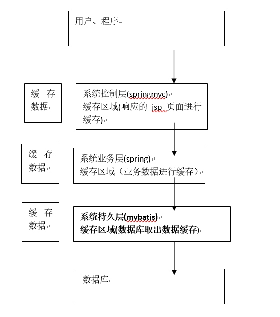
### mybatis持久层缓存
- mybatis提供一级缓存和二级缓存。

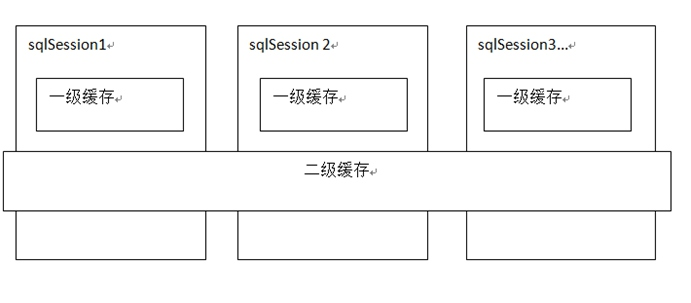
- mybatis一级缓存是一个SqlSession级别，SqlSession只能访问自己的一级缓存的数据，二级缓存是跨SqlSession，是mapper级别的缓存，对于mapper级别的缓存不同的SqlSession是可以共享的。
### 一级缓存
#### 原理

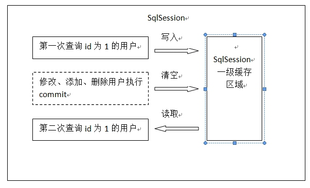
- 第一次发出一个查询sql，sql查询结果写入sqlSession的一级缓存中，缓存使用的数据结构是一个map<key,value>
    - key:hashcode+sql+sql输入参数+输出参数
    - value:用户信息
- **同一个sqlSession**再次发出**相同的sql**，就从缓存中取数据，不从数据库中取数据。如果两次中间出现**commit操作**(修改、添加、删除)，本sqlSession中的**一级缓存区域全部清空**(目的是为了防止查出脏数据)，下次再去缓存中查询，查询不到数据，所以要从数据库查询，从数据库查询到数据再写入缓存。

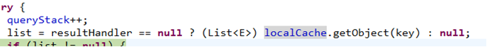
1. 如果缓存中查询到则将缓存数据直接返回。
2. 如果缓存中查询不到就从数据库查询。

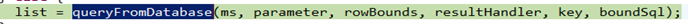
#### 一级缓存配置
- mybatis默认支持一级缓存不需要配置。
- **注意:mybatis和spring整合后进行mapper代理开发，不支持一级缓存，mybatis和spring整合，spring按照mapper模板去生成mapper代理对象，模板中在最后统一关闭SqlSession。**(sqlSession关闭后，一级缓存也就清空了)
### 二级缓存
- 二级缓存的范围是mapper级别(mapper同一个命名空间，**mapper的命名空间是可以相同的**)，mapper以命名空间为单位创建缓存数据结构，结构是map <key,value>。

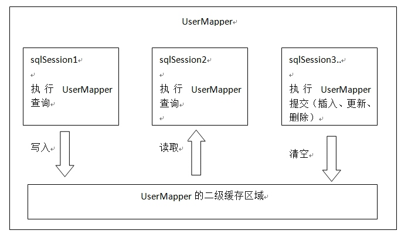
- 每次查询先看是否开启二级缓存，如果开启就从二级缓存的数据结构中取缓存数据，如果从二级缓存没有取到，再从一级缓存中找，如果一级缓存也没有，就从数据库查询。

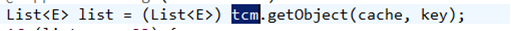
#### mybatis二级缓存配置
在核心配置文件SqlMapConfig.xml中加入
```xml
<setting name="cacheEnabled" value="true"/>
```

|设置项|描述|允许值|默认值|
|-----------|-----------|-----------|-----------|
|cacheEnabled|对在此配置文件下的所有cache 进行全局性开/关设置。|true、false|true|

- 要在你的Mapper映射文件中**添加一行：  <cache /> ，表示此mapper开启二级缓存**。
#### 查询结果映射的pojo序列化
- mybatis二级缓存需要将查询结果**映射的pojo实现java.io.serializable接口**，如果不实现则抛出异常:org.apache.ibatis.cache.CacheException: Error serializing object.  Cause: java.io.NotSerializableException: cn.itcast.mybatis.po.User
- 二级缓存可以将内存的数据写到磁盘，存在对象的**序列化和反序列化**，所以要对pojo类实现java.io.serializable接口。
```java
public class User implements Serializable {

	private int id;
	private String username;// 用户名
	private String sex;// 性别
	private Date birthday;// 出生
	private String address;// 地址
	
	//多个订单
	private List<Orders> orderList;
	//getter and setter
```
#### 二级缓存禁用
- 对于变化频率较高的sql，需要禁用二级缓存:
    - 在statement中设置useCache=false可以禁用当前select语句的二级缓存， 即每次查询都会发出sql去查询，默认情况是true，即该sql使用二级缓存。
```xml
<select id="findOrderListResultMap" resultMap="ordersUserMap" useCache="false">
```
#### 刷新缓存
- 如果sqlSession操作commit操作，对二级缓存进行刷新(全局清空)。
- 设置statement的flushCache是否刷新缓存，默认值是true。(一般该属性设置在insert、update、delete标签上)
#### 测试代码
```java
/**
	 * 通过ID查询指定用户
	 * @throws Exception 
	 */
	@Test
	public void cacheTest() throws Exception {
		
		SqlSession sqlSession1 = sqlSessionFactory.openSession();
		SqlSession sqlSession2 = sqlSessionFactory.openSession();
		SqlSession sqlSession3 = sqlSessionFactory.openSession();
		
		UserMapper userMapper1 = sqlSession1.getMapper(UserMapper.class);
		UserMapper userMapper2 = sqlSession2.getMapper(UserMapper.class);
		UserMapper userMapper3 = sqlSession3.getMapper(UserMapper.class);
		
		//记得关sqlSession，否则不是从二级缓存中查
		
		//第一次查询id为1的用户
		User user1 = userMapper1.findById(1);
		System.out.println(user1);
		sqlSession1.close();
		
		//中间修改用户，要清空二级缓存，为了防止出现脏数据
		user1.setUsername("王六");
		userMapper3.updateUser(user1);
		sqlSession3.commit();
		sqlSession3.close();
		
		
		
		//第二次查询id为1的用户，在没有执行增加、删除、修改操作前，通过二级缓存查
		User user2 = userMapper2.findById(1);
		System.out.println(user2);
		sqlSession2.close();
	}
```
### mybatis的cache参数(了解)
- mybatis的cache参数只适用于mybatis维护缓存。
- flushInterval(刷新间隔)可以被设置为任意的正整数，而且它们代表一个合理的**毫秒形式**的时间段。默认情况是不设置，也就是没有刷新间隔，缓存仅仅调用语句刷新。
- size(引用数目)可以被设置为任意正整数，要记住你缓存的对象数目和你运行环境的可用内存资源数目。默认值是1024。
- readOnly(只读)属性可以被设置为true或false。只读的缓存会给所有调用者返回缓存对象的相同实例。因此这些对象不能被修改。这提供了很重要的性能优势。可读写的缓存会返回缓存对象的拷贝(通过序列化)。这会慢一些，但是安全，因此默认是false。
- 如下例子:
```xml
<cache  eviction="FIFO"  flushInterval="60000"  size="512"  readOnly="true"/>
```
- 这个更高级的配置创建了一个 FIFO 缓存,并每隔 60 秒刷新,存数结果对象或列表的 512 个引用,而且返回的对象被认为是只读的,因此在不同线程中的调用者之间修改它们会导致冲突。可用的收回策略有, 默认的是 LRU:
    - LRU – 最近最少使用的:移除最长时间不被使用的对象。
    - FIFO – 先进先出:按对象进入缓存的顺序来移除它们。
    - SOFT – 软引用:移除基于垃圾回收器状态和软引用规则的对象。
    - WEAK – 弱引用:更积极地移除基于垃圾收集器状态和弱引用规则的对象。
## mybatis和ehcache缓存框架整合
mybatis二级缓存通过ehcache维护缓存数据。
### 分布缓存
将缓存数据进行分布管理。  
 
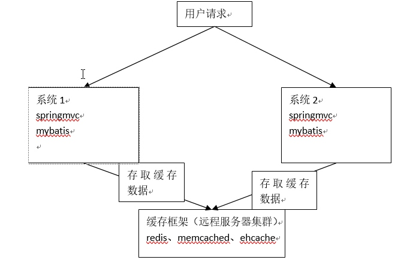
### mybatis和ehcache整合思路
- 通过mybatis和ehcache框架进行整合，就可以把缓存数据的管理托管给ehcache。
- 在mybatis中提供一个cache接口，只要**实现cache接口**就可以把缓存数据灵活的管理起来。

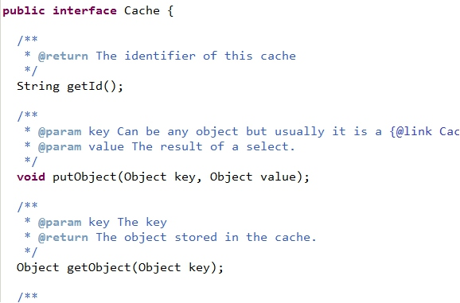
- cache接口在mybatis中的默认实现:

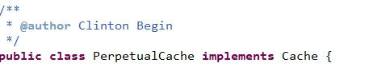
### 下载和ehcache整合的jar包

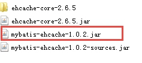
- ehcache对cache接口的实现类

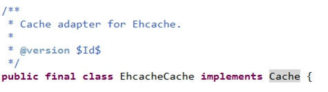
- 该类是ehcache中实现mybatis的Cache接口，进而才实现缓存数据托管给ehcache。
### 配置ehcache.xml

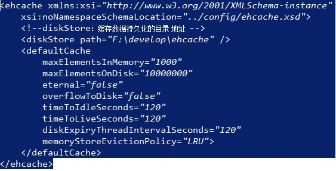
### 整合测试
- 在mapper.xml添加ehcache配置:

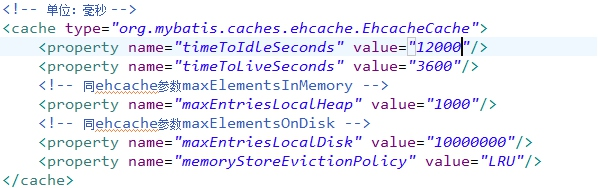
- 该配置是在mapper.xml中的cache标签中配置
    - type:指定的是ehcache中实现mybatis的cache接口的类
    - 标签内的配置，是对单个mapper.xml进行的单独个性化配置。在ehcache.xml进行的配置是全局配置。
### 二级缓存的应用场景
- 对查询频率高，变化频率低的数据建议使用二级缓存。
- 对于访问多的查询请求且用户对查询结果实时性要求不高，此时可采用mybatis二级缓存技术降低数据库访问量，提高访问速度，业务场景比如：耗时较高的统计分析sql、电话账单查询sql等。
- 实现方法如下：通过设置刷新间隔时间，由mybatis每隔一段时间自动清空缓存，根据数据变化频率设置缓存刷新间隔flushInterval，比如设置为30分钟、60分钟、24小时等，根据需求而定。
### mybatis局限性
mybatis二级缓存对**细粒度的数据**级别的缓存实现不好，比如如下需求：对商品信息进行缓存，由于商品信息查询访问量大，但是要求用户每次都能查询最新的商品信息，此时如果使用mybatis的二级缓存就无法实现当一个商品变化时只刷新该商品的缓存信息而不刷新其它商品的信息，因为mybaits的二级缓存区域以mapper为单位划分，当一个商品信息变化会将所有商品信息的缓存数据全部清空。解决此类问题需要在业务层根据需求对数据有针对性缓存。  
## mybatis和spring框架整合